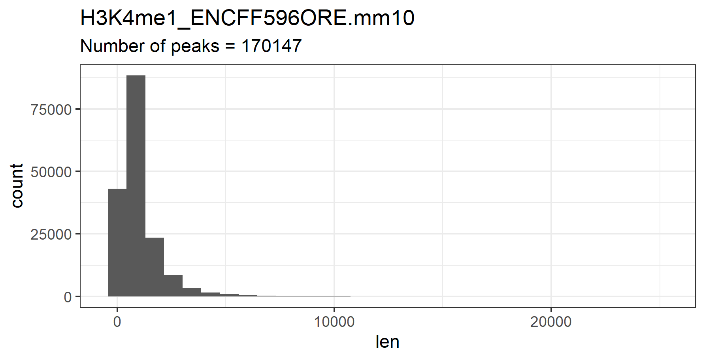
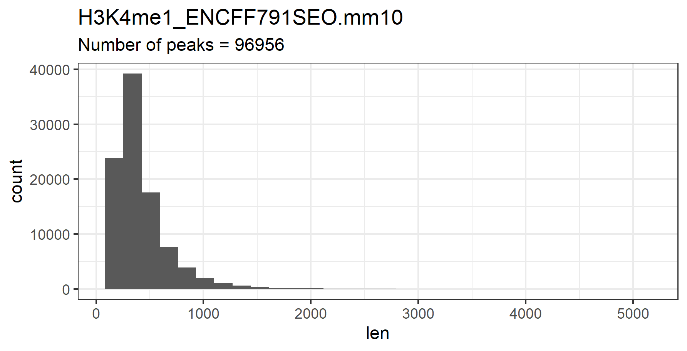
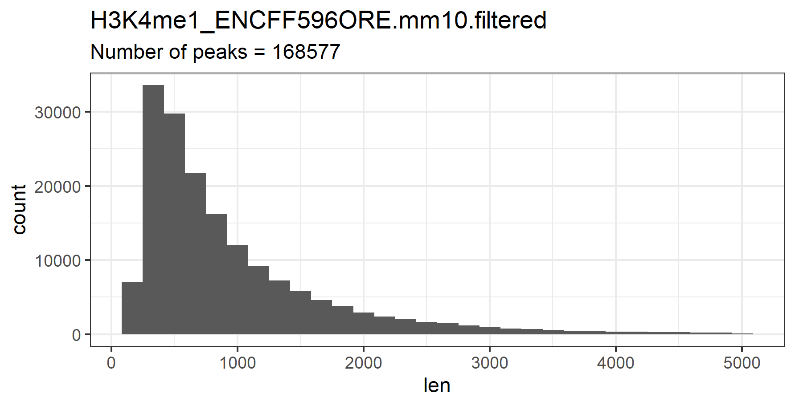
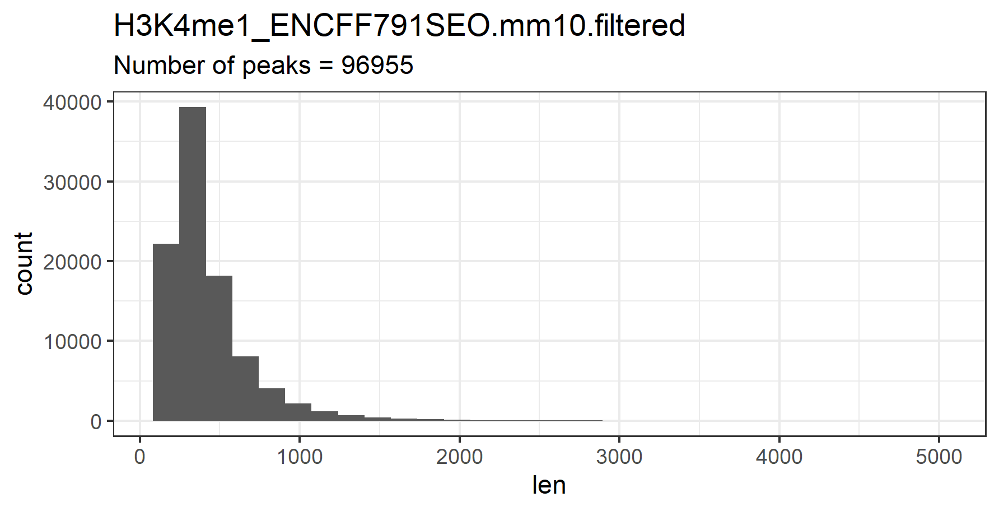
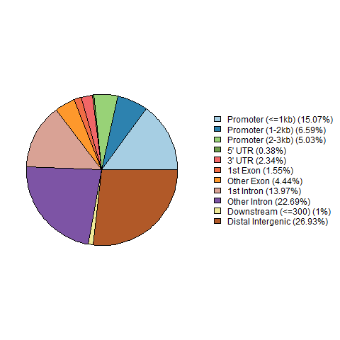
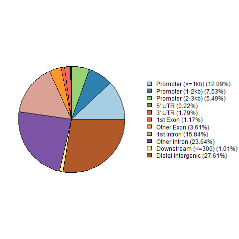
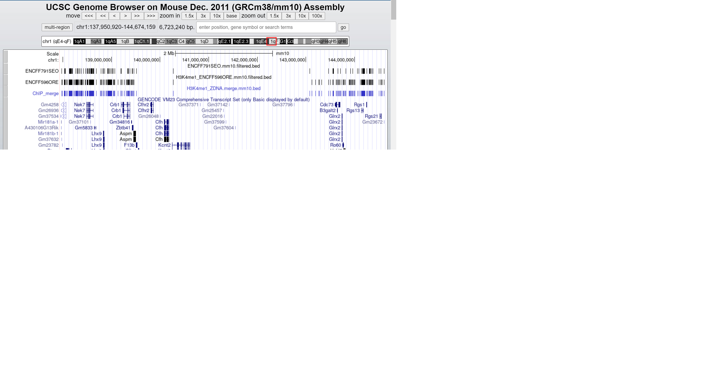
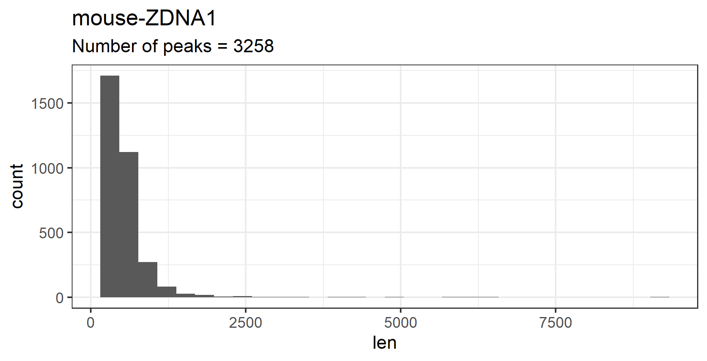
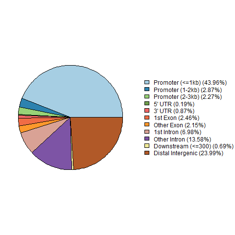

# hse21_H3K4me1_ZDNA_mouse

#  Кудрявцев Семен Алексеевич, 4 группа, доклад о проделанной работе
# # Анализ пиков гистоновой метки
В данной работе будет рассматриваться гистоновая метка H3K4me1 в геноме мыши (сборка генома mm10).
Я выбрал клетку CH12.LX и в ней эксперименты ENCFF596ORE и ENCFF791SEO.

Сначала я скачал bed-файлы экспериментов и для работы с ними обрезал до первых пяти столбцов:
> wget https://www.encodeproject.org/files/ENCFF791SEO/@@download/ENCFF791SEO.bed.gz
> 
> wget https://www.encodeproject.org/files/ENCFF596ORE/@@download/ENCFF596ORE.bed.gz
> 
> zcat ENCFF791SEO.bed.gz  |  cut -f1-5 > H3K4me1_ENCFF832EOL.mm10.bed
> 
> zcat ENCFF596ORE.bed.gz  |  cut -f1-5 > H3K4me1_ENCFF832EOL.mm10.bed

Затем я построил гистограммы длин участков для каждого распределения. и оставил только те, длины которых не превышают 3000.

​

​

И оставил только те, длины которых не превышают 5000. Вот новые гистограммы:

​

​

Число пиков сократилось не значительно. Со 170к до 168к в одном эксперименте и всего на один в другом.

Рассмотрим, где располагаются пики гистоновой метки относительно аннотированных генов:

​

​

Как мы видим, большинство пиков приходится на интроны и межгенные участки.

Затем я объединил два набора отфильтрованных ChIP-seq пиков с помощью утилиты bedtools merge.

>cat  *.filtered.bed  |   sort -k1,1 -k2,2n   |   bedtools merge   >  H3K4me1_ZDNA.merge.mm10.bed 

Можно проверить корректность работы bedtools, визуализировав пики до и после объединения в геномном браузере:

​

Кажется, все работает!

# # Анализ участков вторичной структуры

Сначала я скачал файл ZDNA_mouse_1 в папку data. И обрезал нужные нам колонки для работы

> wget https://drive.google.com/u/0/uc?id=1gFY4Ma9OWFJBWVhgdV3TqTf8pgy_ghKy&export=download
> cat mouseZ-DNA1.bed   |  cut -f1-5 > mouse-ZDNA1.bed

Рассмотрим распределение длин участков вторичной структуры ДНК и их расположение относительно аннотированного генома:
​

​

Здесь мы видим, что большинство координат участков вторичной структуры ДНК попадают на промоторы генов.

# # Анализ пересечений гистоновой метки и стр-ры ДНК

Находим вышеуказанное пересечение с помощью команды bedtools intersect

> bedtools intersect  -a mouse-ZDNA1.bed   -b  H3K4me1_ZDNA.merge.mm10.bed  >  H3K4me1_ZDNA.intersect_with_DEEPZ.bed

